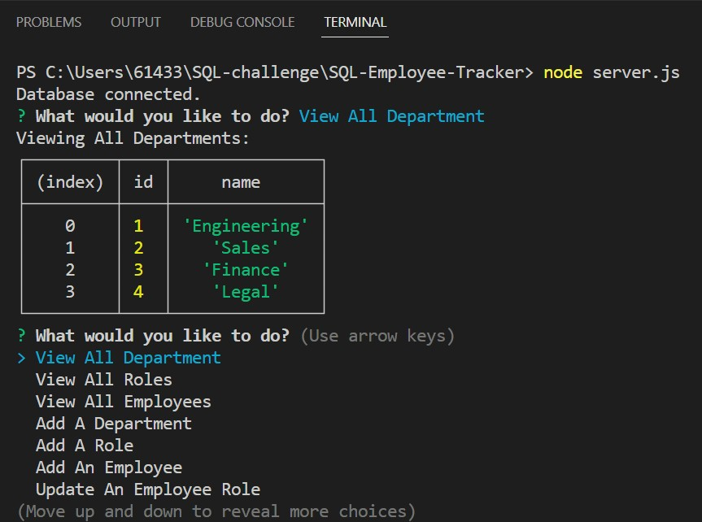

# SQL-Employee-Tracker

## Description

This project was created to create an application for Employee Tracker that can be used to see whole department, employees, role and save new department, employee, roles. It contains node.js, JavaScript, .mysql, npm

I created a Employee Tracker with using the mySQL and inquirer in npm package that meets certain criteria.

This app runs in the terminal.

I learned how to get data from data base and Insert data to data base.

Also I learned how to make queries asynchronous
 

## Installation

N/A  

## Usage

To understand the code that I code, please read the comments in code.

When User starts the application, the user will be ppresented with the following options: view all departments, view all roles, view all employees, add a department, add a role, add an employee, and update an employee role.

When User chooses to view all departments, the user will be presented with a formatted table showing department names and department ids.

When User chooses to view all roles, the user will be presented with the job title, role id, the department that role belongs to, and the salary for that role.

When User chooses to view all employees, the user will be presented with a formatted table showing employee data, including employee ids, first names, last names, job titles, departments, salaries, and managers that the employees report to.

When User chooses to add a department, the user will be prompted to enter the name of the department and that department is added to the database.

When User chooses to add a role, the user will be prompted to enter the name, salary, and department for the role and that role is added to the database.

When User chooses to add an employee, the user will be prompted to enter the employee’s first name, last name, role, and manager, and that employee is added to the database.

When User chooses to update an employee role, the user will be prompted to select an employee to update and their new role and this information is updated in the database.
 

How to operate : Run the command "node server.js" to run the software.
The command prompt will begin on your terminal  

 

(screenshot image could be slitely different with the web application)

## Video

https://drive.google.com/file/d/1BbBmZkulRwrM5OaTwZwZYpg9277hc3H6/view

## Credits

N/A

## License

N/A